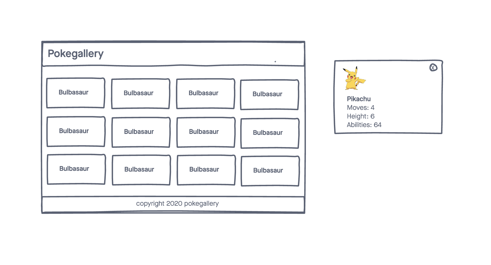

# PokeGallery

A simple web application that displays Pokemon data using the Pokemon API

## Technologies Used

- HTML5
- CSS3
- JavaScript
- jQuery
- Google Fonts
- jQuery Modal
- Pokemon API

## Screenshots

## Getting Started

[Click Here](#) to see the deployed app!

## Future Enhancements
- The ability to favorite and save Pokemon to local storage